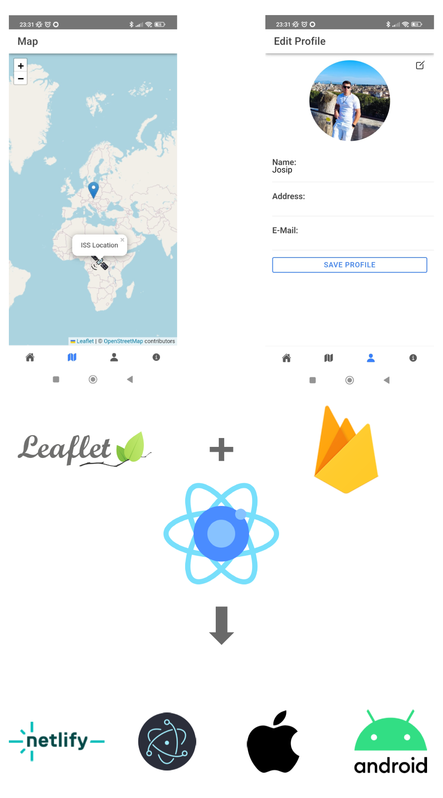

# Ionic-Multiplatform

This app has been developed using Ionic React as part of my Cross-Platform University course. It efficiently manages
user profile data through Firebase integration and incorporates a Leaflet map for enhanced functionality. The map
displays the live location of the ISS (International Space Station) and the user's location.

What sets this app apart is its versatility. It can be built for Android and iOS, as well as configured as a Progressive
Web App (PWA) and an Electron Desktop application. The PWA version is hosted on Netlify, allowing easy accessibility at
this link (note that all HTTP traffic is blocked for security
reasons): https://guileless-kitsune-35f6f3.netlify.app/tab1

